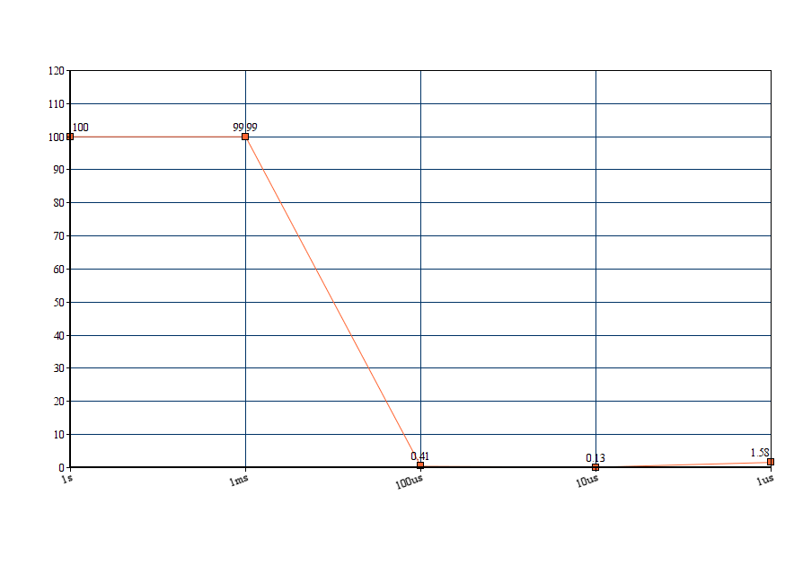

# MQTT Load Generator :fire:

[](https://travis-ci.com/I1820/lg)
[](https://www.codacy.com/project/i1820/lg/dashboard)

**Sometimes we tell lies, sometimes we prove we don't lie. Let's prove ourselves.**

## Introduction
This application gives a way for creating a load with MQTT.
MQTT is a messaging protocol and various platforms work with it so
creating a load with MQTT creates a way for testing platforms.

## Generator
LG is fully customizable so you can generate data with
your own structure and publish it on your own topic.
For this LG has the `Generator` interface is defined in `generator/`.

## Running
You can run LG with following syntax:

```sh
lg --broker 127.0.0.1:1883 --deveui 0000000000000073 --rate 1ms
```

## Set I1820 on fire
With this load generator we try to put load on I1820 and we get following results:


